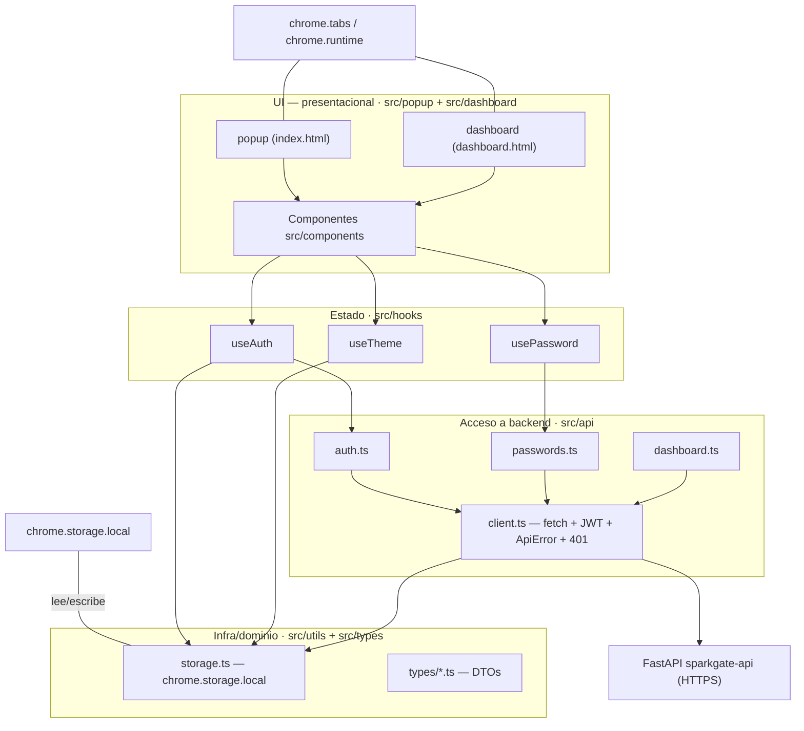
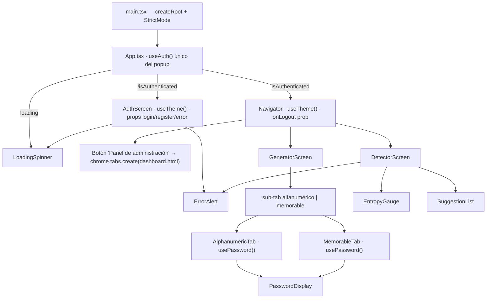
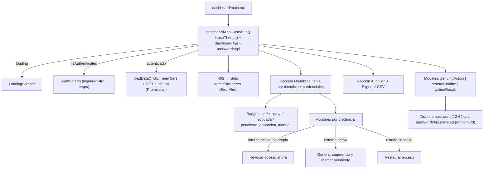
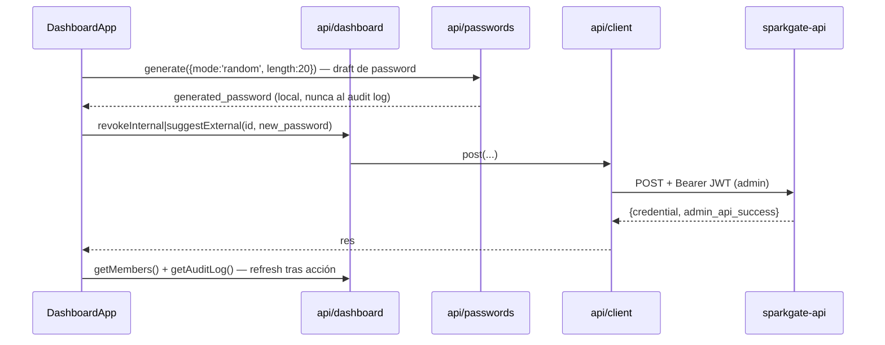
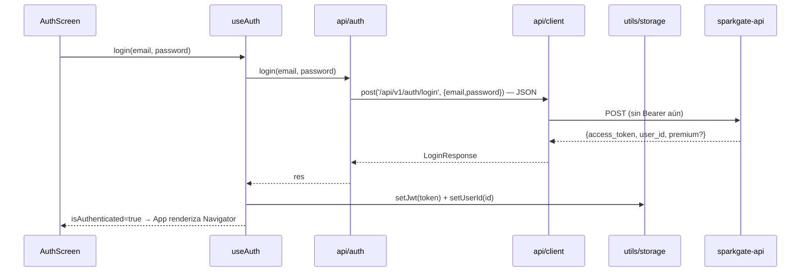
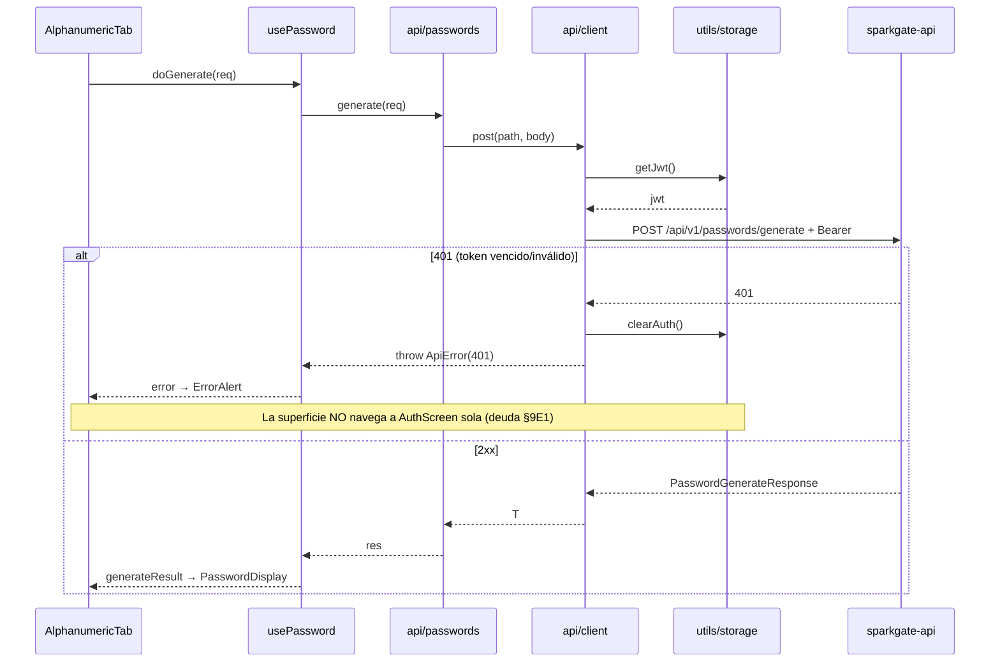

# Arquitectura — SparkGate Extension

> Documento vivo. Describe capas, componentes, flujos y modelo de datos de la
> extensión, con trazabilidad a las invariantes de `SPEC.md` (§V). La matriz de
> pruebas/historias vive en [`PRUEBAS.md`](./PRUEBAS.md).
>
> Última actualización: sprint 1 (offboarding SP-1 incluido).

## 1. Vista general

Extensión Chrome **Manifest V3, popup-only**: no hay `content_scripts` ni
inyección en páginas de terceros. Todo el código es una SPA React 18 empaquetada
por Vite y abierta dentro del popup (`index.html`, 360×500px) o como página de
pestaña completa (`dashboard.html`, panel de administración).

Dos **superficies de UI** comparten el mismo núcleo (api, hooks, storage):

| Superficie | Entry | Uso |
|---|---|---|
| Popup | `index.html` → `src/popup/main.tsx` → `App` | Generar/evaluar contraseñas (usuario) |
| Dashboard | `dashboard.html` → `src/dashboard/main.tsx` → `DashboardApp` | Administración de miembros y credenciales (admin) |

El dashboard se abre desde el popup con `chrome.tabs.create({url:
chrome.runtime.getURL('dashboard.html')})` (fuente: `src/components/Navigator.tsx`).

Ambas superficies son **independientes entre sí**: cada una llama `useAuth()` en
su raíz y comparten sesión vía `chrome.storage.local` (no es duplicado de
estado, es el diseño — ver §6.1).

## 2. Capas

Regla de oro del código: **el flujo de datos baja en una sola dirección** y cada
capa solo conoce a la inmediatamente inferior.

- **UI** no toca `chrome.storage` ni `fetch` directamente; solo llama hooks.
- **Hooks** orquestan lógica y mantienen estado local del componente.
- **Módulos api** son stubs tipados por endpoint; delegan en `client.ts`.
- **client.ts** es el único punto de `fetch`, attach de `Authorization: Bearer`,
  limpieza de sesión en 401 y normalización de errores (`ApiError`).
- **storage.ts** es el único acceso a `chrome.storage.local`.

## 3. Popup — árbol de componentes

Notas:
- `usePassword()` se instancia **por pestaña/scren** (AlphanumericTab,
  MemorableTab, DetectorScreen). Estado de generación/evaluación es local a cada
  instancia: cambiar de tab descarta el resultado anterior (deuda, §9).
- `useTheme()` aparece en AuthScreen y Navigator: ambos escriben/leen el mismo
  `theme` de storage; el estado React de cada uno es independiente.
- Componentes puramente presentacionales (PasswordDisplay, EntropyGauge,
  SuggestionList, ErrorAlert, LoadingSpinner) reciben datos por props.

## 4. Dashboard — panel de administración (SP-1)

Flujo de acciones admin (revoke/suggest/restore):

## 5. Flujos de secuencia

### 5.1 Login

### 5.2 Generar contraseña + manejo de 401

## 6. Modelo de datos

### 6.1 Estado local persistido (`chrome.storage.local`)

Sin base de datos local (no IndexedDB). Persistencia = 3 claves:

| Clave | Tipo | Escritura | Limpieza |
|---|---|---|---|
| `jwt` | `string` | `useAuth.login/register` → `setJwt` (`src/utils/storage.ts`) | `logout`, `clearAuth` (401) |
| `user_id` | `string` | `useAuth.login/register` → `setUserId` | `logout`, `clearAuth` (401) |
| `theme` | `'light' \| 'dark'` | `useTheme.toggleDark` → `setTheme` | nunca |

Ciclo de vida: login/register setean `jwt`+`user_id`; logout y 401 los remueven
juntos (`clearAuth`, `storage.ts:25`). `theme` sobrevive a logout (preferencia
de UI, ⊥ del sistema).

### 6.2 Contratos API (DTOs tipados, `src/types/`)

Todos los body son **JSON** (`application/json`), incluidos los de auth. Los
errores normalizan a `{detail: string}` (`ErrorResponse`).

**auth** (`types/auth.ts`):

| Endpoint | Request | Response |
|---|---|---|
| POST `/api/v1/auth/register` | `{email, password}` | `RegisterResponse{messaje, user_id, plan, access_token?}` |
| POST `/api/v1/auth/login` | `{email, password}` | `LoginResponse{access_token, user_id, premium?}` |
| POST `/api/v1/auth/logout` | — (Bearer) | `{message}` |

**passwords** (`types/passwords.ts`):

| Endpoint | Request | Response |
|---|---|---|
| POST `/api/v1/passwords/evaluate` | `PasswordEvaluateRequest{password, context?}` | `PasswordEvaluateResponse{is_compromised, pwned_count, entropy_bits, entropy_threshold_met, ai_score, ai_feedback, ai_suggestions}` |
| POST `/api/v1/passwords/generate` | `PasswordGenerateRequest{length[12-64], mode, ...}` | `PasswordGenerateResponse{generated_password, explanation, entropy_bits}` |

**dashboard** (`types/dashboard.ts`, admin):

| Endpoint | Request | Response |
|---|---|---|
| GET `/api/v1/dashboard/members` | — | `Member[]{id, full_name, email, role_title?, credentials: Credential[]}` |
| GET `/api/v1/dashboard/audit-log` | — | `AuditLogEntry[]` (nunca password) |
| POST `/api/v1/dashboard/credentials/{id}/revoke` | `{new_password?[12-64]}` | `CredentialActionResponse{credential, admin_api_success}` |
| POST `/api/v1/dashboard/credentials/{id}/suggest` | `{new_password?[12-64]}` | `CredentialActionResponse{...}` |
| POST `/api/v1/dashboard/credentials/{id}/restore` | — | `CredentialActionResponse{...}` |

Tipos de dominio: `CredentialType = 'interna' | 'externa'`;
`CredentialStatus = 'activa' | 'revocada' | 'pendiente_aplicacion_manual'`.

### 6.3 Regla de oro sobre contraseñas

Las contraseñas generadas/sugeridas **nunca se persisten ni se envían al audit
log** (invariante V9): viven solo en estado React efímero y se muestran para
copiar (modal de resultado). El CSV de auditoría exporta metadatos de la acción,
no el secreto (`DashboardApp.tsx:199-220`).

## 7. Invariantes §V → código

| Invariante | Dónde se aplica |
|---|---|
| V1 — Bearer en toda llamada | `client.ts:21-26` (getJwt → header) |
| V2 — 401 limpia y navega | `client.ts:38-40` (clearAuth). Navegación: parcial — ver §9E1 |
| V3 — Auth body JSON | `client.ts:64-76` (JSON.stringify; `isForm` sin uso) |
| V4 — length 12–64 | slider `AlphanumericTab.tsx:37-38`; validación draft `DashboardApp.tsx:31-32,464-466` |
| V5 — dark desde storage (⊥ system) | `useTheme.ts:7-12` (init + `dark:` class en `<html>`) |
| V6 — Plan badge mock | `AuthScreen.tsx:97-109` ("Gratuito", Upgrade disabled) |
| V7 — Popup 360×500 | `App.tsx:19,26` (contenedores fijos) |
| V8 — Dashboard solo admin | `DashboardApp.tsx:93-95` (403 → `forbidden`) → `ErrorAlert "Solo administradores"` (`:268-270`); self-revoke oculto (`:324-337`) |
| V9 — Password nunca al log | CSV export sin password (`DashboardApp.tsx:199-220`); password solo en modal efímero (`:537-558`); `api/dashboard.ts` no incluye password en audit |
| V10 — Revoke bloquea de inmediato | `DashboardApp.tsx:450` (copy de UI: ban inmediato, token válido ~1h) |
| V11 — Logout Bearer revoca sesión propia | `useAuth.ts:75-85` (bearer vía client + `clearAuth()` global) |

## 8. Buenas prácticas aplicadas (y dónde)

- **Un solo punto de red**: `fetch` existe únicamente en `client.ts`. Verificado
  por grep — ningún componente/hook llama `fetch` directo.
- **Un solo acceso a `chrome.storage`**: `utils/storage.ts`. Los hooks y client
  pasan por ahí; test `src/test/setup.ts` mockea exactamente esa superficie.
- **`useAuth()` único por superficie**: `App.tsx:6-15` y `DashboardApp.tsx:61`.
  Dos superficies → dos instancias intencionadas, nunca varias dentro de una.
- **Tipos centralizados por dominio** con el snake_case del contrato API; sin
  `any` en la frontera de red (`types/auth`, `types/passwords`,
  `types/dashboard`, `types/common`).
- **Errores normalizados**: `ApiError{status, detail}` para UI; mensajes de
  error UI en español.
- **Cero secretos en log/repo**: `.env` gitignored; `VITE_API_URL` inlineada en
  build; contraseñas efímeras (V9).
- **Props down / hooks up**: presentacionales reciben datos por props; lógica
  en hooks.

## 9. Decisiones técnicas y deuda conocida

### Decisiones

- **Sin CRXJS**: plugin `remove-crossorigin` en `vite.config.ts` — Vite plano +
  `cp manifest.json dist/` en build (fix de MIME type en extensiones
  desempaquetadas).
- **Multi-entry build**: `rollupOptions.input {popup, dashboard}` —
  `vite.config.ts:18-25`.
- **Firefox sin polyfill**: `browser_specific_settings.gecko` en manifest
  (chrome.* APIs disponibles en MV3 desde v109).
- **`post()` con param `isForm` sin uso** (`client.ts:58-79`): conservado para
  hipotéticos endpoints form-urlencoded.

### Deuda técnica

| # | Deuda | Impacto |
|---|---|---|
| E1 | **V2 incompleta**: tras 401, `client.ts` limpia storage pero no hay `storage.onChanged` listener ni re-`checkAuth` → la superficie **no navega sola** a AuthScreen; el usuario ve el error en el panel hasta recargar el popup | UX: sesión muerta aparentemente viva |
| E2 | `usePassword` por tab (3 instancias) → cambiar de tab descarta resultado | UX menor |
| E3 | `useTheme` duplicado (AuthScreen + Navigator) — consistente vía storage pero con doble estado React | Frágil ante cambios futuros |
| E4 | Dashboard 571 líneas en `DashboardApp.tsx` (lógica + UI + modales en un solo archivo) | Mantenibilidad |
| E5 | `RegisterResponse.access_token` opcional + `plan` en respuesta: contrato no cubierto en SPEC `I.auth-register` | Drift menor |

## 10. Trazabilidad con SPEC

- Tasks `T1-T14` (x todos) en `SPEC.md` §T; invariantes `V1-V11` §V.
- Endpoints consumidos: ver tabla de bridge en `AGENTS.md` local y §6.2 aquí.
- Interfaz de red central (client) cumple `I.error` (∀ 4xx/5xx → `{detail}`).